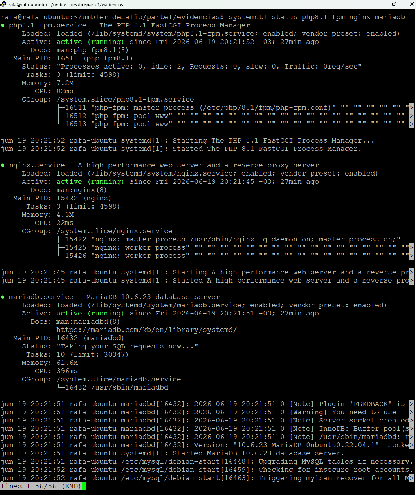

## Parte 1 - Diagnóstico e Troubleshooting

Foi desenvolvido um procedimento básico de troubleshooting para ambientes Nginx + PHP-FPM, contemplando:

* Diagnóstico de erro 502 Bad Gateway;
* Verificação de serviços;
* Consulta de logs;
* Identificação das causas mais comuns;
* Script de health check para validação dos serviços e da aplicação.

### Evidências

Para mais detalhes sobre o processo de diagnóstico e troubleshooting, consulte:

- `parte1/troubleshooting.md`

#### Serviços ativos

#### Execução do Health Check

